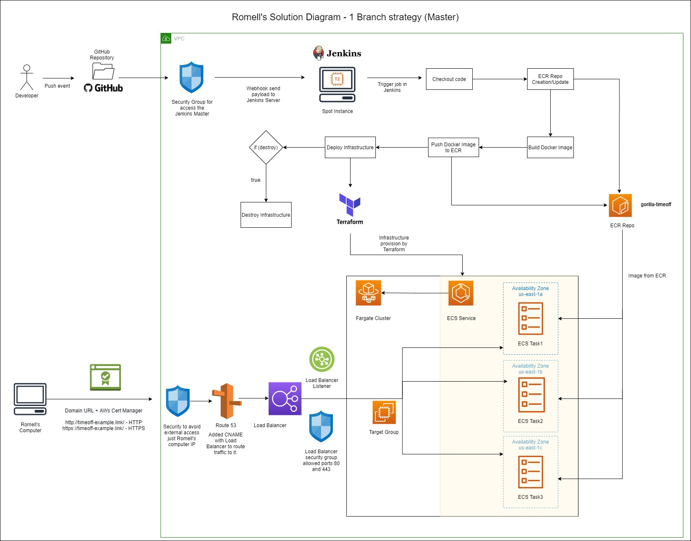

# Romell\'s Proposed Solution

## Use case

The Challenge presented about the need to deploy an application *Timeoff Management* to a fully automated and deployed to Cloud environment, this documentation provides the technologies and practices used to fulfill the requirements below

* Architecture diagram demonstrating planned solution.
* Timeoff-management fork on local repository (Github, CodeCommit, BitBucket, GitLab, etc).
* Required infrastructure running on cloud providers of preference, provisioned using some sort of infrastructure as code solution.
* Application must be deployed using a fully automated continuous integration solution, triggered by a change in source control.
* Application must be secured from external access and the application should be serving via standard HTTP and HTTPS protocols.
* The application should be highly available and load balanced.

## Architecture diagram demonstrating planned solution

The architecture diagram JPG file is located inside the **solution_digram** folder in the root directory of the repository 

## Timeoff-management fork on local repository (Github, CodeCommit, BitBucket, GitLab, etc)

The forked repository should be found at https://github.com/raguirreg10/timeoff-management-application.git, besides the source code for the application there are the following components added to work with the CI/CD technologies and IaC as well.

* **terraform** folder: Manages the infrastructure as code files, in this case Terraform, to provision the necessary services in the Cloud to run the application. 
* **Jenkinsfile**: Manages the pipeline instructions and how to Build and Deploy the application, also provides instructions on the destruction of the infrastructure as needed.
* **Dockerfile**: Provides the instructions on how to containerize the application.

## Required infrastructure running on cloud provider of preference, provisioned using some sort of infrastructure as code solution

The complete infrastructure is provisioned by **HashiCorp Terraform** along **AWS Cloud Provider**, inside the terraform folder there should be 2 folders: **ecr** and **fargate**, each of them contains the necessary _variables_, _outputs_ and _configfiles_ to be used to create the services to the Cloud. More information about terraform can be found at HashiCorp Terrafrom official webpage: https://www.terraform.io/ 

## Application must be deployed using fully automated continuous integration solution, triggered by a change in source control

The continuous integration and continuous delivery strategy is handled by Jenkins Master (spot instance in AWS) and an Agent where the jobs are executed, in order to enable events triggered by changes, the GitHub repository is configure to communicate to Jenkins Server via Webhooks, this webhooks listen to any changes in the source control repository and send the corresponding payloads to Jenkins, the master server received these payloads and trigger jobs according the corresponding branch where this changed were executed.

## Application must be secured from external access and the application should be serving via standard HTTP and HTTPS protocols

To protect the application from external access, there is a specific Security Group which deny the incoming external traffic to the application, just allowing 1 IP to demo the application from Romell's Computer, this was intentional done and anyone outside this IP should not be able to access the application, in addition, the domain **timeoff-example.link** is protected with a certificate and this allows to access the application via HTTPS protocols, by enabling the listener the corresponding ports and certificate to provide a secure traffic to the app, therefore, the application can be access by HTTP (80) and HTTPS (443).

* http://timeoff-example.link  -> HTTP
* https://timeoff-example.link -> HTTPS

## The application should be highly available and load balanced

To achieve the load balancing and high availability the application was launch in ECS Cluster of type FARGATE, within this cluster there is a count of 3 replicas of the containers and each of these containers were located in a separate Availability Zone (us-east-1a, us-east-1b and us-east-1c), with this strategy the application is ensured that if for any reason any of the AZs is down, the load balancer will traffic the requests to other healthy AZs, also there is a health check to ensure the application container\'s ports are listening and accepting the traffic, if not, will remove this container and create a new one.

## Deployment upgrade/downgrade strategy

Finally, for deployments of new version of the application, the pipeline will follow a rolling update deployment, where a new set of containers is created and when the new set is ready, the old ones are shutdown, the developer just change the code in the Source Control Repo and Jenkins will do the change by call the `aws ecs update-service` command and this will trigger a new set of containers with the new version of the application that is pushed to ECR registry.

To downgrade the developer can revert back the changes and push them to the repository, Jenkins will trigger a new job with those changes and push back the image to ECR repository and the new updated service would replace the version.

## Secret Management

All sensitive information is handled by Jenkins Credentials Manager to avoid any exposure of critical information, to use them in the pipeline is necessary to use the credentials helpers methods to retrieve them masked with no visibility to the users or stored in the logs.

## AWS Components

* **ECR Repository**: stores the necessary images to be used in the deployment.
* **Security Groups**: provides protection to allow/deny access to certain ports.
* **EC2 Instance**: Spot instance where Jenkins Master and Agent are serving the pipelines.
* **ECS Cluster**: Holds the ECS Services.
* **ECS Service**: Group of ECS Task.
* **ECS Tasks**: Definition for the containers, ports, image to be used.
* **IAM Role**: Neccesary to grant permission to other services in AWS thorugh policies.
* **Application Load Balancer**: Redirect the traffic to the corresponding backend endpoints.
* **Load Balancer Listener**: Listen the ports where LB should allow incoming traffic.
* **Target Groups**: Backend endpoints where the traffic is directed to from the Load Balancer.
* **VPC**: Virtual Private Cloud to gather and allow communication from all the AWS components within.
* **Subnets**: Necessary to provide access to the services and subdivide the IP network.
* **Availability Zones**: data centers with redundant power, networking, and connectivity in an AWS Region, used to high availability if one is unreachable.
* **Route53**: Domain *timeoff-example.link* registration and CNAME aliases to match the Load Balancer and send traffic to it.
* **AWS Cert Manager**: Provided the SSL certificate to allow communication encrypted through HTTPS protocol (443 port).

## Why this architecture?

The reason for choosing this architecture was because it fulfills all the necessary requirements, starting from the selection of ECS Services such as **FARGATE** launch type because is an managed service of container from AWS so it doesn't need to take care about the underlying infrastructure in case of EKS where is necessary to take care of the Cluster management this provides more flexible and fast deployment with lower cost, besides of this, Jenkins was chosen to manage the CI/CD process because is very flexible and Open Source where there is official image from DockerHub and is very intuitive to use through Jenkinsfile where the pipelines are built by following step-step functionalities, Jenkins also provides a fast way to connect to SCM repos by just allowing the webhook to trigger jobs where the code is updated, also Jenkins provides a great secret management process where can be called and injected to the pipeline. This pipeline contains variables to provide flexibility to the developers to change pieces of code and propagate them where are needed, such as tags in the image, location of execution of the Terraform commands, AWS credential information in env variables.

Terraform was chosen the IaC solution, because is cloud agnostic and provides features to propagate changes to any cloud provider by using the corresponding provider utility within, if very useful if the code should scale to other cloud provider such as Azure or Google Cloud Platform, ECR repository was selected due to the easy-to-use way to implement and image provision to ECS services. The Domain was purchased through Route53 to implement a more-fashion way to access the application and avoid to type the complete Load Balancer DNS, this provides a more human readable format by just typing it to the browser.

The solution provided replace the human interversion and manual process through a simplfied way to keep your code in one place and deploy when you need.